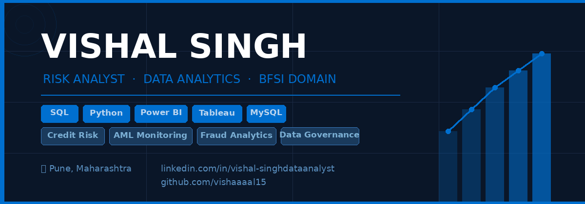

---

## 📊 Featured Projects & Live Dashboards

| Project | Tools | Live Dashboard |
|---|---|---|
| 🏦 Credit Risk & Loan Portfolio | SQL · Python · Power BI | [View →](#) |
| 🔍 AML Transaction Monitoring | SQL · Python · Power BI | [View →](#) |
| 📉 Loan Default Risk Analysis | SQL · Python · Power BI | [View →](#) |
| 📊 Customer Campaign Analytics | SQL · Python · Tableau | [View →](#) |
| 👥 Retail Banking Insights | SQL · Python · Power BI | [View →](#) |
| 🛡️ Data Quality & Governance | SQL · Python · Tableau | [View →](#) |

---

## 🛠️ Technical Skills

**Risk & Analytics:** Credit Risk · AML Monitoring · Fraud Detection · KRI Development · Data Governance

**Technical:** SQL (Advanced) · Python · Power BI · Tableau · Excel · Scikit-learn · MySQL · Git

---

## 📍 About

Data & Risk Analyst specialising in Banking Analytics, Credit Risk, AML Monitoring, and Fraud Detection across 250K–500K+ financial records. Building end-to-end analytics solutions for BFSI — from raw data to executive dashboards.

📍 Pune, Maharashtra · Open to Risk Analyst roles
